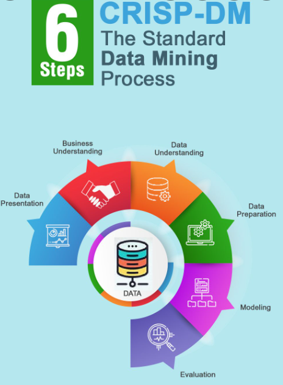
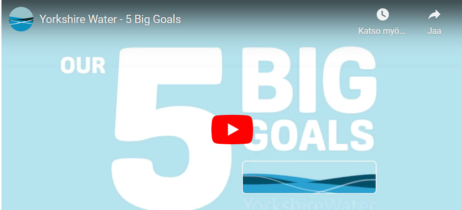
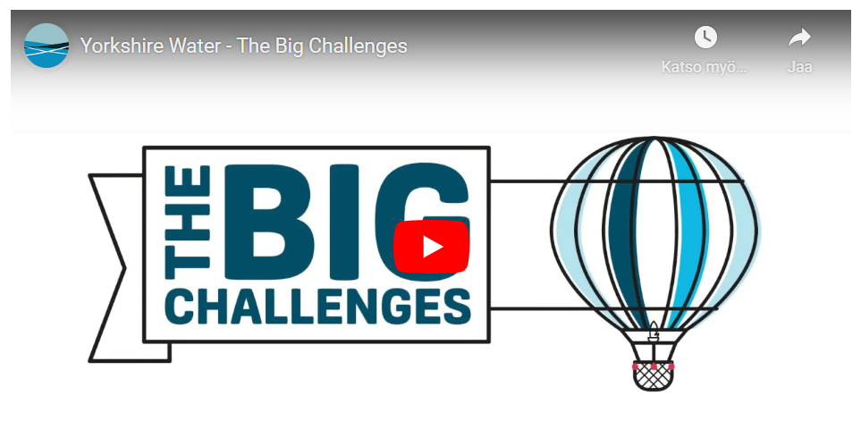
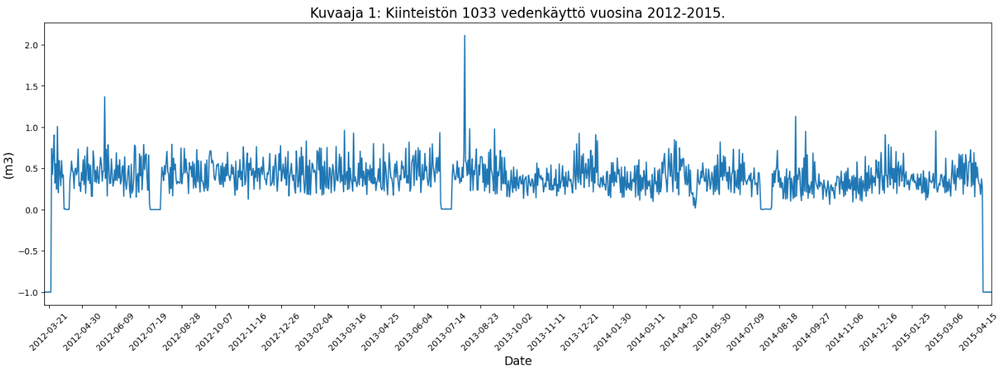
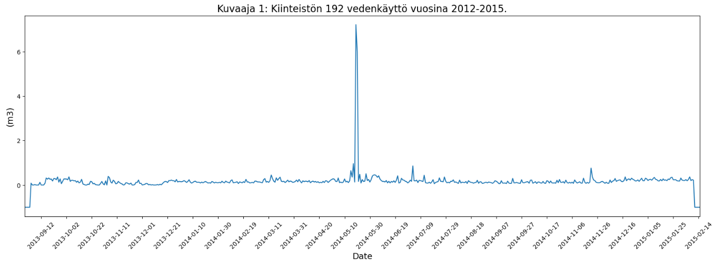
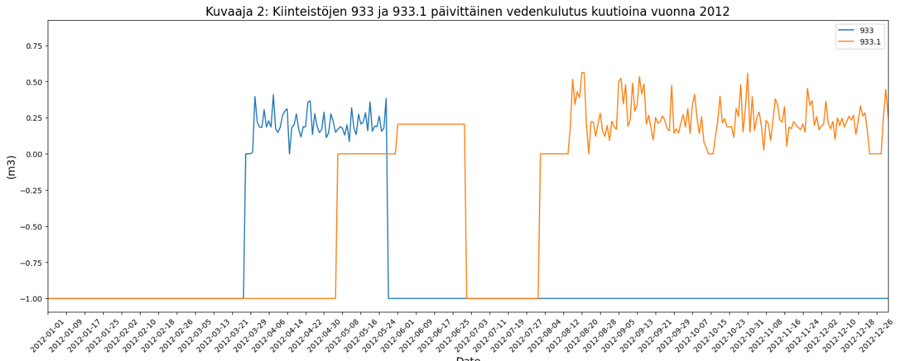
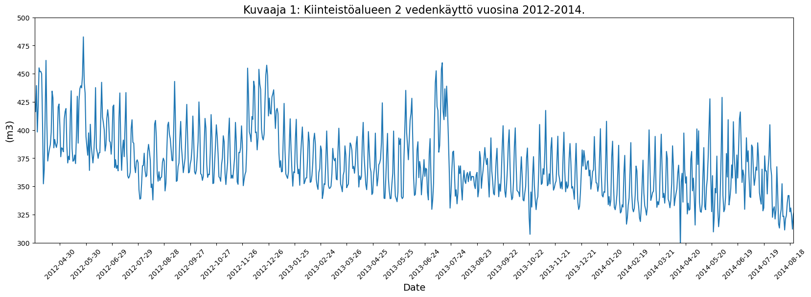

## Tehtävä: Opiskelijaryhmän tiedot
    * Sanna 
    * Sanni Kattilakoski 
    * Tomi  

Tehtävien maksimipistemäärät:

| Teht. 1 | Teht. 2 | Teht. 3 | Yhteensä |
|---------|---------|---------|----------|
| 5p      | 5p      | 5p      | max. 15p |

--------------------

## Tehtävien 1-5 alustus 

Tehtävissä **1-5** on kuvitteellinen tilanne, jossa **ryhmänne on konsultoimassa vesiyhtiötä**.

* Datalähteenä on **Yorkshire Water** -yhtiön julkaisemat vedenkäyttötilastot vuosilta **2012-2015**
* Datalähteenä tehtävässä on: https://datamillnorth.org/dataset/yorkshire-water-daily-customer-meter-data--local-area-

Huom! Voitte käyttää tulosten analysoinnissa annettua [Yorkshire Water Jupyter Notebook -dokumenttia](jupyter_data/YorkshireWater_data_analysointi.ipynb). 
Sitä voi ja pitääkin hieman muuttaa data- ja tulosanalyysia varten.

Seuraavassa hieman lisätietoa datasta sen tarjoajan sivuilta:

* A dataset showing daily water consumption readings in cubic metres (m3) from internal and/or external meters in a discrete study in two distribution management areas (DMAs) in Yorkshire between 2013 and 2015.
* This data is taken from a live localised project investigating water use. 
* The data has been anonymised to remove personal data and make it Data Protection Act compliant. 
* The DMAs are also anonymised to prevent any open data activity affecting the results of the ongoing study the data has been taken from.

### Videomateriaali 
Katso videomateriaali aina ennen tehtävien tekemistä. Tämä on tärkeää, koska on hyvä pyrkiä ymmärtämään käsitteitä ennen vastausten kirjoittamista. 
* Tehtävien lopussa on lista hyödyllisistä videoista ja muista lähteistä
* Tehtävissä keskeisin asia on **CRISP-DM -prosessi**
* Ennen tehtäviä kannattaa katsoa videot **01-05**.

### Tehtävät 1-5 vs. CRISP-DM standardi prosessimalli

--------------------
# Tehtävä 1: Ongelman kuvaaminen  (Business Understanding)

Haetaan vastaukset kysymyksiin: 
* Millainen data on kyseessä?
* Missä yhteydessä tästä datasta voi olla hyötyä?
* Millainen liiketoiminta on datan taustalla?
* Mitä kaikkea datasta voidaan oppia?
* Mitä datasta voidaan nähdä?
* Mitä datasta voidaan tunnistaa?
* Voidaanko datasta havaita jotain poikkeavaa?
* Tarvitaanko tämän lisäksi jotakin muuta lisätietoa?

Palautetaan vastaus repositoryyn annettuun palautuspäivämäärään mennessä:
* palautus tehdään MarkDown-formaatissa (tarkenne .md), jolloin kuvat ja kaaviot linkitetään dokumenttiin. 

**Lähteitä:**
* Video - **05 CRISP-DM Alku**
* Katso Myös Video **10: Tekoälyprojektin roolitus**

## Tehtävä 1: Vastaus 

## Taustaa

Kyseessä on [Yorkshire water](https://www.yorkshirewater.com/) -niminen vesilaitos, joka tarjoaa alueelle käytännössä käyttöveden palveluita eli se aine, mitä hanasta tulee. Vesilaitoksen intresseissä on pyrkiä tarjoamaan laadukasta palvelua asiakkaille ilman mittavia kustannuksia. Käytännössä tämä tarkoittaa laitoksen puolelta riittäviä puhdistusmekanismeja sekä laadukasta vesijohtojärjestelmää, joka takaa veden korkean ja tasaisen laadun. Jos vesijohtoveteen pääsee epäpuhtauksia jostakin syystä, se on vesilaitokselle kallista ja sitä ei oikein voi periä asiakasmaksuissa. Tosin asiakasmaksuilla taataan järjestelmän kunto ja siihen tarvittavat huoltotoimenpiteet voidaan suorittaa ajallaan. Toki järjestelmä vaatii jatkuvaa seurantaa ja voisin kuvitella laitoksen vuosikellossa olevan eri vuodenaikoihin ajoitettuja huoltotoimenpiteitä.

### Yrityksen liiketoiminta-ajatus (suora lainaus verkkosivuilta):

*We provide water and waste water services to the people of Yorkshire. To do this we collect 1.3 billion litres of raw water from the environment every day. We use energy and chemicals to treat the water so that it is safe to drink. To get the water to where it is needed we use gravity where we can but we also have to use energy to pump it through 31,600km of pipes*. 

### Strategia lyhyesti (suora lainaus verkkosivuilta):

*The 5.4 million people who live in Yorkshire and the millions of people who visit Yorkshire each year rely on our services for  their basic health needs and lifestyles. 140,000 businesses use our water to provide goods and services that support the economy, not just of Yorkshire, but the whole of the UK*.

Yrityksen viisi päämäärää ovatkin:

 1. asiakkaat
 2. veden saatavuus
 3. ympäristö
 4. läpinäkyvyys
 5. laskut

Ja suurimmiksi haasteiksi yritys listaa:
 
 1. kasvavan populaation
 2. asiakkaiden monimuotoisuuden
 3. taloudelliset haasteet
 4. äärimmäiset sääolosuhteet
 5. merenpinnan nousu
 6. selviytyminen kuivista kesistä
 7. yhteisöön fokusoituminen

## Itse tehtävä

Tehtävänannossa tarkastellaan Yorkshiren alueen kiinteistöistä kerättyä dataa vedenkulutuksesta ajalta 2012 - 2015 ja yhdessä yksittäisessä sarakkeessa on yhden kiinteistön vedenkulutus 1.1.2012 - 31.12.2015. Data on csv -muodossa, jolloin sitä ei pääse rikastamaan eli tieto on staattista ja oikeaa.

Datasta nähdään, milloin veden kulutus on suurimmillaan ja pienimmillään. Tällöin voidaan päätellä myös, milloin suurin osa kiinteistöissä asuvista on lomalla, etätöissä tai lähitöissä, jolloin veden kulutus muuttuu. Myös kiinteistöjen koolla ja varustelutasolla on myös vaikutuksensa veden kulutukseen. Toisaalta isommissa kiinteistöissä voi vedenkulutus olla suurta, mutta taas toisaalta markkinoilla on tarjolla laitteita, joiden veden kulutus on pientä, eikä siitä voida vetää suoria johtopäätöksiä kulutukseen. Tässä arvioinnissa auttaa vähän kuluttajille tehty asiakaskysely, jos vastaajat ovat täyttäneet kyselyn oikein. Mutta niissä on todennäköisesti laskettu oma virhepoikkeama. Se, miten se korreloi vesilaitoksen oman datan kanssa, on vähän arvoitus. Oletettavasti tämä data on pelkästään yksityisasunnoista, eikä tässä ole mukana liikehuoneistoja.

Dataa lukemalla toivottavasti löydetään poikkeamat ja niille syyt. Poikkeamassa näkyy varmasti ainakin se, onko vesijohdossa ollut putkirikko jolloin veden kulutus on noussut huomattavasti lyhyen ajan sisällä. Toki korjaustoimenpiteiden ollessa käynnissä, vedenkulutus on todennäköisesti väliaikaisesti täysin nollassa.

## Miten tieto palvelee eri sidosryhmiä

Ensiksi voisi tarkastella sitä, mistä asiakkaan lasku koostuu: (https://www.yorkshirewater.com/bill-account/how-we-work-out-your-bill/)

1. puhdas vesi - kotiin tuleva vesi ja laskutus on joko vesimittarin lukemasta tai perustuen kiinteistön verotusarvoon
2. vesijohtojärjestelmä - veden puhdistaminen ja palauttaminen takaisin järjestelmään, jossa oletuskäyttöaste 95 %
3. pintavesi - sadevesien poisto viemäristä
4. moottoritien viemäröinti - teiden ja kävelyteiden vesien johtaminen yleiseen viemäriin
5. kiinteät maksut - asiakaspalvelu, putkien ja viemäreiden kunnossapito...

Jos mietitään datan hyödyllisyyttä tältä kannalta, kun tuottoja saadaan asiakasmaksuista, pystytään huolehtimaan myös muista yhteisöhyödyllisistä tavoitteista eli tämä pitää myös muuta infrastruktuuria kunnossa. Ja kun infrastruktuuri on kunnossa, siitä saadaan kaikkia hyödyttäviä verotuloja, sekä muuttamaan alueelle mahdollisesti lisää asukkaita. Data hyödyttää niin asiakkaiden lisäksi myös yritysen omistajia. Ja datan perusteella voidaan tehdä ennustetta tuleville vuosille.

Data ei ole aivan kattava, koska kaikkia kiinteistönumeroita ei ole. Miten puuttuva tieto tai nolla-arvot käsitellään kokonaisdatan kanssa, se täytyy miettiä. Pudotetaanko ne jopa kokonaan datasta pois vai lasketaanko keskiarvo ja mennään sen mukaan. Oli tapa mikä hyvänsä, pääasia on etteivät tulokset vääristy liikaa ja tehdä sen perusteella virheellisiä päätelmiä mm. tulevaisuutta silmällä pitäen.

Yorkshire water -yhtiön pitkän tähtäimen suunnitelma, joka on tehty 08/2018 löytyy allaolevasta linkistä.

https://www.yorkshirewater.com/media/tcjjr5on/yorkshire-waters-long-term-strategy-august-2018-min.pdf

Yorkshire waterin vuosikertomus 2020

https://www.yorkshirewater.com/media/0wbbmdu2/29938_yw_annual_performance_report_2020_web.pdf

--------------------

TODO: Kirjoita vastauksesi MarkDown-formaatissa, jolloin sen voi liittää suoraan tehtävädokumenttiin.
* [MarkDown-tutorial](https://www.markdownguide.org/basic-syntax/).
* Liitä vastaukseen myös tarvittavat kuvakaappaukset yms.

--------------------
# Tehtävä 2: Datan kuvaaminen (Data Understanding)

* Millaisia muuttujia on datassa?
* Mitä arvoa on käytetty täytearvona?
* Millaisia korrelaatioita datasta löytyy?
* Tarkistelee dataa tietyillä aikaväleillä (esim. viikko, kuukausi tai vuosi).
* Havaintojen tueksi voi liittää visualisoitua dataa
* Mieti mitä tällä datalla voidaan mahdollisesti tehdä?

Palautetaan vastaus repositoryyn annettuun palautuspäivämäärään mennessä:
* palautus tehdään MarkDown-formaatissa (tarkenne .md), jolloin kuvat linkitetään dokumenttiin

Datan käsittely:
* Katso julkaistu [Yorkshire Water Jupyter Notebook -dokumentti](jupyter_data/YorkshireWater_data_analysointi.ipynb) 
* Tätä voitte käyttää apuna datan ymmärtämisessä
* Sitä voi myös täydentää lisähavaintojen ja -analyysin tekemiseen (voi itse ohjelmoida lisää)

**Lähteitä:**
* Video - **05 CRISP-DM Loppuosa**

Kannattaa myös katsoa seuraavat videot:
* **18: Data ja sen laatu**
* **19: Huono Data**
* **20: Laadun arviointi ja formaatit**

## Tehtävä 2: Vastaus 

**Data koostuu kiinteistöjen vedenkulutusmääristä kuutioina (m3) ajalla 2012-2015 ja asukkaille tehdystä kyselytutkimuksesta ajalla 2018-2020.** 

## Vedenkulutusdata  

Pääasiallinen data (*Yorkshire_external_meters_2012_2015.csv*) sisältää vesiyhtiön ulkoisten mittareiden kautta kerättyjä vedenkulutusmääriä, ja sen voidaan olettaa olevan hyvälaatuista. Mitattu vedenkulutusdata koostuu 2091 sarakkeesta ja 1461 rivistä. 2085 sarakkeessa näkyy kunkin kiinteistön vedenkulutus ja kuudessa sarakkeessa on erilaisia aikaan liittyviä määritteitä. Riveillä näkyy kunkin kiinteistön päiväkohtainen vedenkulutus. Täytearvona veden kulutuksessa on käytetty arvoa -1. Tämä tarkoittaa sitä, että silloin vedenkulutusta ei ole mitattu.   

Olennaisimpia muuttujia ovat:
* kiinteistönnumero  
* aikaan liittyvät käsitteet   

Dataan kuuluvien kiinteistöjen kiinteistönumerot ovat 1-2158, mutta välistä puuttuu joitakin kiinteistönumeroita kokonaan. Tämä johtuu siitä, että näissä kiinteistöissä on pelkästään sisäiset vesimittarit ja data käsittelee ulkoisten vesimittareiden kautta saatuja lukemia. Vedenkulutusdataa voidaan tarkastella eri ajankohtien ja aikavälien mukaan, kuten vuoden, kuukauden, viikon, päivän, viikonpäivän ja päivämäärän mukaan.   

Näiden lisäksi *Daily_m3_1315.csv*-tiedostosta löytyy seuraavat muuttujat:
* DMA-alue eli alueverkko
* mittarin sijainti   

*Siitä käy myös ilmi, että kiinteistönumerot juoksevat lukuun 2160 asti, jos myös sisäiset vesimittarit otetaan huomioon. Kiinteistöt 1-790 sijaitsevat alueverkon 1 ja kiinteistöt 791-2160 alueverkon 2 alueella. Alueella 2 olevien kiinteistöjen vedenkulutustietojen kerääminen on alkanut maaliskuussa 2012 ja alueella 1 syyskuussa 2013. Kiinteistöissä on joko sisäinen tai ulkoinen vesimittari tai molemmat.*

### Havaintoja mittausdastasta

Kiinteistöjen vedenkulutuksesta on huomattavissa loma-ajat, jolloin kulutuslukema tippuu nollille. Alla olevassa kuvassa näkyy hyvin maaliskuussa 2012 pidetty loma sekä joka vuosi heinä-elokuulle ajoittuva loma.

On luonnollista, että kulutuskäyrä heilahtelee ja vedenkäyttö on eri kuukasina, viikkoina ja viikonpäivinä hieman erisuuruista. Yksittäisiä piikkejä voivat selittää mm. kotona vietetyt lomat ja ystävien majoittaminen. Jos yksittäinen piikki on huomattava, kuten seuraavassa kuvassa, saattaa kyseessä kuitenkin olla vuoto tai mittausvirhe.

Mittausdatassa on 43 kiinteistöä, joilla on perinteisen kiinteistönumeron lisäksi toinenkin kiinteistönumero, kuten 933 ja 933.1. Oletettavasti näihin kiinteistoihin on vaihdettu uusi vesimittari mittausjakson aikana joko putkirikon korjauksen yhteydessä tai sen vuoksi, että mittari täytyy vaihtaa tietyin aikavälein.

### Datan hyödyntäminen
Mitatun vedenkulutusdatan avulla vesiyhtiö voi ennustaa veden kulutusta sekä hahmottaa, minkä verran asiakkaille kertyy laskutettavaa. Lisäksi datasta on nähtävissä erilaiset poikkeamatilanteet, kuten putken rikkoutumiset.

## Kyselytutkimus

Kyselytutkimusdata koostuu 13748 kotitalouden vastauksesta, ja sen 96 sarakkeesta löytyy runsaasti erilaisia tietoja kiinteistöstä ja sen varustelutasosta sekä asukasmäärästä ja asukkaiden vedenkäyttötavoista. Muuttujina ovat mm.
* asunnontyyppi
* asukkaiden määrä
* erilaisten vesikalusteiden lukumäärä: suihkut, vessanpöntöt, altaat, kylpyammeet, keittiön hanat
* onko astianpesukonetta ja/tai pyykinpesukonetta, ja niiden käyttökerrat viikossa
* käytetäänkö vesijohtovettä autonpesuun ja/tai puutarhankasteluun 
* millaisia vuotoja asunnossa on ollut
* onko vesimittaria
* kotitalouden käyttöveden määrä litroina  

Kyselyyn vastanneet ovat ilmoittaneet asunnontyypikseen omakotitalon, paritalon, rivitalon, kerrostalon tai mökin. Asukasmäärät vaihtelevat 1-10 välillä. Kyselytutkimuksesta on nähtävissä, että mitä enemmän asunnossa asuu ihmisiä ja myös mitä suurempi asunnon varustelutaso on, sitä suurempi on vedenkulutus. Poikkeuksena tähän on että, astianpesukoneen käyttäminen vie vähemmän vettä kuin käsin tiskaaminen. Kyselytutkimusdatassa on puutteita ja siitä käy ilmi, että osa ei ole vastannut kaikkiin kysymyksiin. Ylipäänsä kyselytutkimuksen käyttäminen mittausdatan rinnalla tai tukena on hieman kyseenalaista juuri sen puutteellisuuden vuoksi, mutta myös siitä syystä, että kyselytutkimus on tehty eri ajankohtana kuin mittausdata kerätty. 

--------------------

TODO: Kirjoita vastauksesi MarkDown-formaatissa, jolloin sen voi liittää suoraan tehtävädokumenttiin.
* [MarkDown-tutorial](https://www.markdownguide.org/basic-syntax/).
* Liitä vastaukseen myös tarvittavat kuvakaappaukset yms.

--------------------------

# Tehtävä 3: Datan valmistelu (esikäsittely, Data Preparation)

* Miten valmistelet datan?
* Mitä piirteitä tai muuttujia erotat datasta jatkokäsittelyä varten?
* Voidaanko jotakin jättää datasta pois?
* Millainen rakenne datassa on?
* Millainen dataformaatti on kyseessä?
* Kannattaako data pilkkoa osiin?
* Joudutaanko dataa mahdollisesti muuttamaan ennen sen jatkojalostusta?
* Mieti tilastotietojen hyötykäyttöä?
* Havaintojen tueksi voi liittää kuvia datasta

Palautetaan vastaus repositoryyn annettuun palautuspäivämäärään mennessä:
* palautus tehdään MarkDown-formaatissa (tarkenne .md), jolloin kuvat linkitetään dokumenttiin

**Lähteitä:**
* Video - **06 CRISP-DM Keskiosa** (Datan valmistelun kuvaus)

Myös kannattaa katsoa seuraavat videot:
* **16: Aineisto**
* **17: Validointi**

Katso julkaistu [Yorkshire Water Jupyter Notebook -dokumentti](jupyter_data/YorkshireWater_data_analysointi.ipynb)

## Tehtävä 3: Vastaus 

Datan valmistelu aloitetaan rajaamalla liiketoimintatarpeen kannalta hyödytön data. Vesiyhtiön kannalta tällaista voi olla kaikki sellainen data, jolla ei vaikuta olevan merkitystä vedenkulutukseen tai on muuten tarpeetonta. Tarpeellikseksi arvioitu data siivotaan ja ratkaistaan puutteet, että jokaisessa näytteessä on käytettävissä tarvittavat asiat. Esimerkiksi mittaamattomat, not a number -arvot käsitellään soveliaalla tavalla. Siivottu data rakennetaan eri lähteistä ja integroidaan käytettäväksi tutkimusdataksi. Lopuksi data formatoidaan, eli muokataan hyödynnettäväksi, jolloin siitä on helppo piirtää kuvaajia ja mallinnuksia. Varmistetaan, että datasta ei puutu arvoja tai sitä on väärässä muodossa.

Vesiyhtiölle tarpeellisimpia piirteitä ja muuttujia ovat vedenkulutus yksittäisten asuntojen ja vedenkulutusalueiden, sekä kellonajan, päivämäärän ja vuodenajan mukaan, joten nämä olisi tärkeää erottaa jatkokäsittelyä varten.

Datasta voidaan jättää pois liiketoiminnan kannalta hyödytöntä dataa esim. kyselytutkimuksista. Lisäksi pois voidaan jättää mittaamattomat täytearvot.

Datan rakenne on kaksiulotteinen excel-taulukko eli matriisi. Datan formaatti on DataFrame.

Koska dataa on paljon, sitä kannattaa pilkkoa osiin. Tällöin datasta saa käsiteltyä paljon helpommin eri muuttujia ja niiden välisiä korrelaatioita. Esimerkiksi kiinteistöalueita ja kiinteistöjä voisi käsitellä erikseen ja rajata tiettyjä vuosia tai vuodenaikoja.

Dataa voidaan muuttaa koneoppimismallien mukaisiksi. Tällöin datan voisi jakaa valmiiksi koulutus-, validointi- ja testausosiin. Lisäksi voidaan koittaa parantaa datan laatua esimerkiksi poistamalla mahdollisia virhemittauksista johtuvia poikkeusarvoja.

Vedenkulutuksen keskiarvo eri vedenkulutusalueilla on varmasti vesiyhtiölle tärkeä tilastotieto, sillä se kertoo suoraan vaadittavan vedentuotantokapasiteetin. Vedenkulutuksen keskihajonta sekä maksimi ja minimikulutus kertovat vaadittavan varastointikapasiteetin määrän, jolloin vesi ei lopu suurimmankaan kulutuksen aikaan ja toisaalta vähäisen kulutuksen aikaan ei ole liikatuotantoa. Tilastotietojen avulla voidaan myös ennustaa vedenkulutusta tulevaisuudessa, mikäli kulutuksen havaitaan muuttuvan ennustettavasti ajan funktiona.

Esim. Tästä kuvaajasta voitaisiin tehdä päätelmä, että kiinteistöalueen 2 vedenkulutuksen päivittäinen keskiarvo on vähän alle 400 kuutiometriä ja se vaihtelee reilun 300:n ja vajaan 500:n kuutiometrin välillä. Kokonaiskulutuksen voisi arvioida olevan hienoisessa laskussa.

--------------------

TODO: Jos kirjoitat vastauksen MarkDown-formaatissa, sen voi liittää suoraan tehtävädokumenttiin.
* [MarkDown-tutorial](https://www.markdownguide.org/basic-syntax/).

----------
