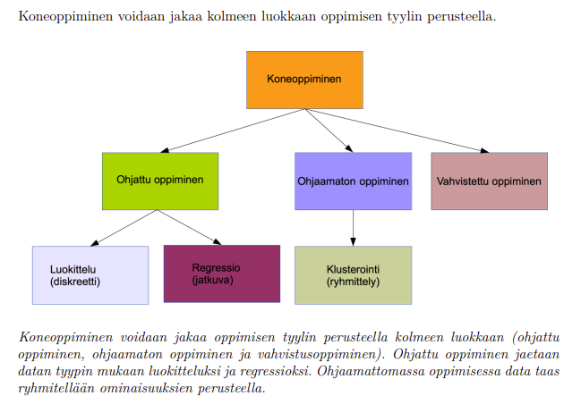
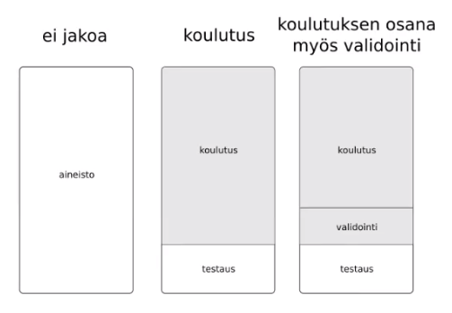
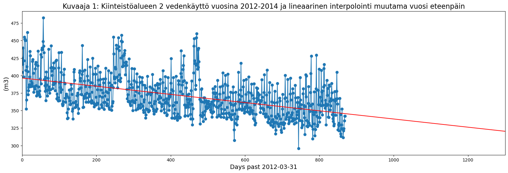
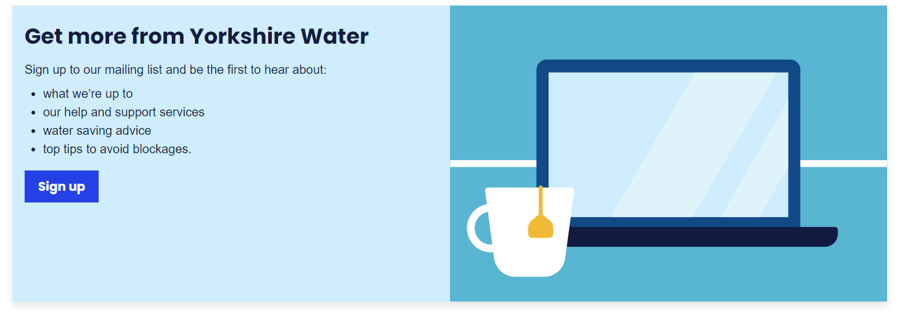

## Tehtävä: Opiskelijaryhmän tiedot
* **Kaikkien ryhmään** kuuluvien opiskelijoiden nimet ja JAMK:n opiskelijatunnukset
    * Sanna Immonen AC8402
    * Sanni Kattilakoski AB5134
    * Tomi Nykänen AD7735

Huom! Vain yksi vastaus tähän ryhmätehtävään per ryhmä. Kaikki vastaukset arvioidaan koko ryhmän jäsenille samalla tavalla.

#### Tehtävien pisteytys

* Opintojakson opettaja laskee pisteet palautuksen jälkeen
* Alla kootusti tehtävien maksimipistemäärät

| Teht. 4 | Teht. 5 | Yhteensä |
|---------|---------|----------|
| 5p      | 5p      | max. 10p |

--------------------

# Tehtävä 4: Datan mallintaminen (Modeling)

Tehtävä on varmasti hieman hankala, mutta mm. näistä valinnoista sitten riippuu paljon
se lopputulos eli kuinka paljon asiakas hyötyy tehdystä data-analyysistä sekä koneoppimismallista.
* Miten mallintaisit datan?
* Millä tavalla päästään haluamaasi lopputavoitteeseen? 
* Regressio?
* Ennustaminen?
* Luokittelu?
* Ryhmittely?
* Ryhmien tunnistaminen datasta?
* Kuvaile Mitä tämän jälkeen tapahtuu CRISP-DM -mallin mukaan (pääpiirteissään)
* Havaintojen tueksi voi liittää kuvia/koodia datasta

Palautetaan vastaus repositoryyn annettuun palautuspäivämäärään mennessä:
* Palautus MarkDown-formaatissa (tarkenne .md), jolloin kuvat linkitetään dokumenttiin

**Lähteitä:**
* Video - **05 CRISP-DM Keskiosa**

Myös kannattaa katsoa:
* **09: KDD-prosessi**
* **11: Tietokone**
* **12: Matematiikka**
* **13: Työkalut**
* **14: Suurteholaskenta**

## Tehtävä 4: Eri kiinteistöjen välistä vertailua
Tehtävänäsi on tehdä vertailua eri kiinteistöjen välillä. Pohdi ainakin seuraavia asioita:
* Millaisia kiinteistöjä lähdedatassa voisi olla mukana?
* Voiko kiinteistöjä ryhmitellä?
* Miten kiinteistöjä voi ryhmitellä?

## Tehtävä 4: Vastaus 

## Mallintaminen 

Datan mallintaminen on prosessi, jossa analysoidaan kaikki kerätyt ja tuotetut tiedot sekä näiden väliset suhteet. Mallinnuskonseptit luovat visuaalisia esityksiä käytetyistä tiedoista ja prosessiin sisältyykin tietovaatimusten ymmärtäminen ja selvitys. Mallintamalla tietoja voidaan dokumentoida, mitä tietoja on, miten niitä käytetään ja mitä vaatimuksia on tietojen käytöstä, suojauksesta ja hallinnosta. (https://powerbi.microsoft.com/fi-fi/what-is-data-modeling/)

Tietomalleissa on kolme päänäkökulmaa:

* **Käsitteellinen malli** on visuaalinen esitys tietokantakäsitteistä ja keskittyy määrittämään järjestelmän entiteetit, niiden 
ominaisuudet ja väliset suhteet.
* **Looginen malli** määrittelee entiteettien rakentee ja tarjoaa lisäkontekstia suhteille tarjoamalla teknisen kartan tietorakenteista
ja säännöistä.
* **Fyysinen malli** on kehys tai skeema, joka määrittää mallin rakennuksen tietokantaan. Edustaa taulukoita, sarakkeita, tietotyyppejä jne. (https://www.dataversity.net/data-modeling-techniques-and-best-practices/#)  

## Koneoppiminen 
*Koneoppiminen on tekoälyn osa-alue, jossa kone/ohjelma oppii pohjatiedon ja käyttäjän toiminnan perusteella tunnistamaan, luokittelemaan ja ennustamaan asioita.* 

  
(https://jyx.jyu.fi/bitstream/handle/123456789/64975/Tekoalyn_Perusteita_edit.pdf?sequence=1&isAllowed=y)  

### Aineiston jakaminen  
Ohjatun oppimisen menetelmissä data jaetaan ensin **koulutus- ja testausaineistoon** (esim. 70/30, 80/20), jonka jälkeen valittu malli opetetaan koulutusaineistolla. Mikäli halutaan selvittää kuinka hyvin malli selviää tuntemattomasta datasta, on mahdollista muodostaa lisäksi **validointiaineisto**. Lopulta mallia testataan ja sen tarkkuutta mitataan testausaineistolla. Ohjaamattomassa oppimisessa dataa ei jaeta eikä mallia tarvitse opettaa etukäteen, vaan malli oppii luokittelemattoman datan pohjalta ja jakaa dataa luokkiin niiden samanlaisuuden tai tiettyjen mallien mukaan.  

  

Mallin onnistumista voidaan mitata erilaisilla menetelmillä, kuten tarkkuuslukemalla (accuracy), kynnysarvon optimointikäyrällä (ROC-käyrä) sekä sekannusmatriisilla.

### Luokittelu

Luokittelussa data jaetaan kahteen tai useampaan ennalta määrättyyn luokkaan, jotka kuvataan diskreeteillä arvoilla. Tätä kutsutaan ohjatuksi oppimiseksi, koska luokat määritellään ennen prosessin alkua. Vedenjakelun kannalta luokittelua voisi olla esim. kiinteistöjen jakaminen asukasmäärän mukaan kyselydatan perusteella.

### Regressio

Regressio on luokittelun kaltaista, mutta data jaetaan jatkuvien muuttujien mukaan, jotka tunnetaan etukäteen. Siksi myös regressiota hoidetaan tyypillisesti ohjatulla oppimisella. Vedenjakelun näkökulmasta tälläisiä voisi olla esimerkiksi kiinteistöjen luokittelu vedenkulutuksen mukaan.

### Ennustaminen

Ennustaminen on tilastotieteen menetelmä, jossa tarkastellaan muuttujan riippuvuutta toisesta muuttujasta ja sen avulla voidaan arvioida muuttujien arvoja myös mittausdatan ulkopuolella. Regressiomenetelmä on tässä siten hyödyllinen.Tässä tapauksessa vesiyhtiölle merkityksellistä voisi olla esim. vedenkulutusalueen, päivämäärän tai vuoden vaikutus vedenkulutukseen. Muuttujien välistä riippuvuutta halutaan mallintaa muodostamalla funktio, joka mahdollisimman hyvin kuvaa niiden yhteyttä. Tärkeää on selvittää, onko funktiomuoto esimerkiksi lineaarinen, eksponentiaalinen tai jotain muuta. Lisäksi valitaan estimointimenetelmä, esim PNS, eli pienimmän neliösumman menetelmä. Muuttujien välille voidaan sitten piirtää regressiokäyrä, jota interpoloimalla voidaan ennustaa muuttujan suuruutta data-alueen mittauspisteiden ulkopuolella, eli esimerkiksi vedenkulutusta tulevina vuosina.

Jos vedenkulutuksen muutos oletetaan lineaariseksi, voidaan keskimääräisen vedenkulutuksen vuonna 2016 ennustaa olevan noin 325 kuutiometriä päivässä.

Jos vedenkulutuksen muutosta mallinnetaan toisen asteen funktion avulla, voidaan kulutuksen ennustaa tasaantuvan noin 350 kuutiometriin päivässä. Tämä on todennäköisesti lineaarista mallinnusta tarkempi, sillä vedenkulutuksen ei voida olettaa laskevan ikuisesti.

### Ryhmittely

Ryhmittely eli klusterointi on luokittelun kaltainen toimenpide, mutta siinä data jaetaan ryhmiin, joita ei tunneta etukäteen. Ryhmittelyä kutsutaan siksi ohjaamattomaksi oppimiseksi tai segmentoinniksi.

Ryhmittelyssä data jaetaan jatkuvien muuttujien mukaan ryhmiin niiden samankaltaisuuden perusteella, eli eri ryhmät sisältävät samankaltaisia havaintoja, eli esimerkiksi taloudet, joiden vedenkulutus on välillä x - y, y - z jne. Tästä kuitenkaan ei välttämättä ole paljon hyötyä, sillä hyvin lähellä toisiaan olevat datapisteet saattavatkin kuulua eri ryhmiin. Siksi ryhmittely on hyödyllisimmillään, kun ryhmien sisäiset erot ovat pieniä, mutta erot toisiin ryhmiin ovat suuria. Mikäli ryhmien sisällä on yhä paljon dataa, voidaan sitä ryhmitellä vielä eteenpäin. Ryhmittelyn hyötynä on, että datasta saadaan helpommin näkymään vain halutun muuttujan vaikutus, koska kaikki muut muuttujat pysyvät samana. Toisaalta mikäli dataa rajataan liikaa, saattaa data loppua kesken mikä vaikeuttaa haluttujen korrelaatioiden löytämistä. Klusteroinnin avulla on mahdollista päästä käsiksi poikkeamiin ja näin voidaan pystyä vaikuttamaan putkivuotoihin ja niistä aiheutuviin vahinkoihin.

### CRISP-DM -mallinnuksen loppuarviointi

CRISP-DM mallin mukaan seuraavaksi arvioidaan lopputulosta ja prosessia, eli saatiinko tutkittu ongelma ratkaistua ja miten seuraava vastaava ongelma saataisiin ratkaistua jouhevammin. Lisäksi mietitään seuraavia työvaiheita ja kirjoitetaan raportti. Näihin voidaan pyytää palautetta myös asiakkaalta ja palautteen pohjalta voidaan tehdä korjauksia ja lisäyksiä aiempiin vaiheisiin. Mikäli projektiin sisältyi jonkinlainen ratkaisu ongelmaan, on CRISP-DM mallin viimeinen vaihe ratkaisun käyttöönotto, valvonta ja ylläpito sekä loppuraportti ja arviointi.

## Pohdintaa

### Yorkshire Waterin data-analysointi

Yorkshire Waterin analyysit tuotetaan ostopalveluina yhteistyössä Data Mill Northin kanssa. 
Datan tiedostotyyppeinä ovat: csv, xls, img, json ja pdf. Näitä on mahdollista ladata omalle koneelle analysointia varten.

[Vesitilanneraportti 2022](January_2022_published.pdf) näyttää todellisen tilanteen aiemmilta vuosilta sekä ennusteen tälle vuodelle.

Yorkshire Waterin eri analyyseja löytyy täältä: https://datamillnorth.org/publisher/yorkshire-water

----------
# Tehtävä 5: Tulosten arviointi (Evaluation / Deployment)

Tehtävässä arvioidaan kaksi osaa:

### 5.1: Projektin tulosten arviointi

* Esitellään tiivistetysti projektin keskeiset tulokset
* Millaiseksi arvioitte projektin tulokset tässä vaiheessa?
* Kuinka helppoa tästä on jatkaa kohti toteutusta?
* Ketkä saatuja tuloksia arvioivat, jos halutaan, että projektille saataisiin rahoitus?
* Miten osoittaisit projektin hyödyn liiketoiminnalle?
* Mitä toimenpiteitä suosittelisitte konsultin roolissa asiakasyritykselle?

Käyttöönoton vaiheet: 

* Millaiset työkalut tarvitaan tuotetun järjestelmän käyttöönottoon
* Miten järjestelmä otettaisiin käyttöön?
* Miten järjestelmän ylläpito järjestetään?
* Kuinka mahdolliset virheet ja ongelmatilanteet korjataan?

### Projektin tulokset:
- Projektissa on analysoitu kiinteistökohtaista päivittäistä vedenkulutusta ajanjaksolla 2012 - 2015 Yorkshiren kaupungissa eri vedenkulutusalueilla. Mittausdataan kuului 2160 kiinteistöä. Lisäksi kiinteistön asukkailta on kyselty eri vedenkulutustottumuksia sekä vedenkulutukseen vaikuttavia tekijöitä vuosina 2018-2020. Datan perusteella on havainnoitu vedenkulutuksen muutosta eri muuttujien vaikutuksesta.
- Projektin tulokset kertovat, että vedenkulutus on hienoisessa laskusuunnassa ainakin vedenkulutusalueella 2. Lisäksi on havaittu eri tekijöistä johtuvia muutoksia vedenkulutukseen (kiinteistöjen asukkaat, vuodenaika ym). Tulokset vaikuttavat luotettavilta.
- Kuinka helppoa jatkaa kohti toteutusta riippuu siitä mitä halutaan toteuttaa. Esim. jos halutaan selvittää vedentarvetta ja tarvittavaa varastointikapasiteetin määrää niin varmasti hyödyllistä, ainakin seuraavien muutaman vuoden ajalle. Toki vedenkulutustottumukset voivat yllättäen muuttua jonkun ulkoisen tapahtuman seurauksena, esim. alueelle rakennetaan iso vettä kuluttava tehdas jolloin kulutus kasvaa.
- Tuloksia arvioivat viranomaiset, poliitikot ja vesilaitoksen työntekijät. Yhtiön omistajat ja mahdolliset osakkeenomistajat ovat myös kiinnostuneita saatavasta datasta. Se vaikuttaa kuitenkin suoraan yrityksen liikevaihtoon. Jos projektista paljastuu jotain yllättävää, niin mahdollisesti myös media.
- Projektin avulla voidaan tarkemmin määrittää vedenkulutusta, jolloin vesilaitos voi varmistaa, että kaupunki saa oikean määrän vettä. Sekä yli- että alituotanto on liiketoiminnalle haitallista. Lisäksi tutkimuksen perusteella voidaan puuttua vedenkulutusta nostaviin tekijöihin. Suuri vedenkulutus maksaa kaupungille rahaa. Toisaalta taas, jos vedenkulutus kasvaa, yhtiö saa myös enemmän tuloja. Tämä voi toisaalta vaikuttaa asiakasmaksuihin alentavasti tai infrastruktuuria pystytään pitämään huippukunnossa, jolloin hallitsemattomia tilanteita ei ilmene niin helposti, esimerkiksi putkirikkojen voisi kuvitella vähenevän. 
- Suositellaan jatkamaan datan keräämistä, sillä mitä enemmän dataa sitä tarkemmat tulokset. Lisäksi voidaan rajoittaa datan keräämistä asoihin, joilla on merkitystä vedenkulutukseen ja karsia asioita, joilla ei ole merkitystä.

## Lopputoimia CRISP-DM:n mukaan

Ehkä yhtenä suurimmista haasteista tässä on se, että saadaan asiakkaalta relevanttia palautetta. Pitää myös ottaa huomioon se, että ensimmäinen analysointikierros ei välttämättä ole edes oikea, vaan määrityksiä ja datan siivoamista pitää tarkentaa. Jos asiakas sanoo,että prosessi meni huonosti, olis tärkeä selvittää se, missä meni huonosti ja toisinpäin se, että missä onnistuttiin hyvin. Negatiivista palautetta tulee paljon helpommin kuin positiivista, vaikka molemmat ovat aivan yhtä tärkeitä lopputuloksen kannalta.

Myös se, että luodaan jatkotoimenpiteet, mihin tästä suunnataan seuraavaksi, ovat tärkeitä. On myös tärkeää ymmärtää se, että tämä on jatkuva prosessi, eikä vaan hetken humaus. Tällöin myös yrityksellä on mahdollisuus kehittää omaa liiketoimintaansa myös sellaisilla osa-alueilla, jotka eivät välttämättä edes tule heti mieleenkään.

Jos tässä tulee konkreettisia tehtäviä tai muita uusia tapoja parantaa yrityksen liiketoimintaa ja ettei tulosten analysointi ei olisi mennyt hukkaan, pitää myös miettiä, miten nämä saadaan tuotantoon käyttöön. Tässä voisi pohtia esimerkiksi seuraavia kysymyksiä:

1. onko palkattava lisää henkilökuntaa 
2. joudutaanko hankkimaan mahdollisesti jotain uusia  laitteita / softaa
3. kuka ottaa ylipäätään analyysin tuloksista tulevat toimenpiteet haltuun ja vie niitä eteenpäin
4. onko ohjeistus riittävää 

Riittävä dokumentaatio on välttämätön koko prosessin ajan.

### 5.2: Jupyter Notebook päivitykset
* Jupyter Notebook - päivitykset, joita ryhmänne teki tämä projektin aikana
* Jupyter Notebook -muutosten antama lisäarvo ajatellen projektin mahdollista jatkoa

### Ryhmän tekemät päivitykset ja kuvaajat
* Kyselydatasta tehtiin hakuja ja niiden perusteella muodostettiin pylväskuvaajia. Nämä löytyvät [Yorkshire water notebookin](https://gitlab.labranet.jamk.fi/AB5134/da-ko-kaytanteet-tehtavat/-/blob/main/crispdm_harjoitukset_t1_t5/jupyter_data/YorkshireWater_data_analysointi.ipynb) lopusta.
* Nelostehtävän kuvien [koodi regressiosuoriin](https://gitlab.labranet.jamk.fi/AB5134/da-ko-kaytanteet-tehtavat/-/blob/main/crispdm_harjoitukset_t1_t5/water.ipynb)  

### Pohdintaa

Yorkshire Waterin haluama keskeisin tieto on tulevien vuosien kokonaisvedenkulutus ja sitä kautta yhtiön tulos. 
Se voidaan pilkkoa pienempiin osiin, kuten tiettyyn alueeseen ja tietyntyyppisiin kiinteistöihin. Ennusteen perusteella
yhtiö näkee mahdollisen tuloskehityksen, joka vaikuttaa eri sidosryhmiin. Omistajille tämä tarkoittaa
mahdollisia osinkoja. Kuluttajan kannalta tämä voisi tarkoittaa toimitusvarmuutta ja tuotteen laadukkuutta.
Yhtiön kannalta se voisi tarkoittaa paremmin ylläpidettyä tekniikkaa ja alueellisesti se hyödyttää siten,
että jos kunnallistekniikka on kunnossa, se luo vetovoimaa alueelle ja tätä kautta taas lisätuloja
yhteisölle ja yhtiölle. Samalla yhtiön pitää miettiä strategiaa tämän tason ylläpitämiseksi.

Toisaalta taas, jos tuloskehitys näyttää negatiiviselle, se vaikuttaa myös samassa
suhteessa toisinpäin. Omistajat jäävät ilman osinkoa, kuluttajille saatavuuden ja laadun heikkenemistä
ja koska rahaa on vähemmän, huolloissa tehdään pakolliset ja vähemmän pakolliset siirtyvät myöhempään
ajankohtaan (esim. isommmat putkistoremontit). Ja samalla alueelta saattaa muuttaa enemmän ihmisiä 
pois kuin tulee tilalle. Yhtiön pitää tässä tilanteessa miettiä uutta lähestymistapaa, jolla tämä tilanne saadaan
kääntymään positiiviseksi. Luultavasti tämä tarkoittaa hetkellistä vesimaksun korotusta ja yhtiön
työntekijämäärän uudelleen arviointia.

### Miten tuloksia voitaisiin siirtää käytäntöön

Jos mietitään asiakastasolla, niin heille on olemassa jo valmis portaali olemassa, jonka
kautta he pystyvät kommunikoimaan yhtiön kanssa ja jonne on helppo lisätä toiminnallisuuksia. Toki täytyy olla siinä
tarkkana, että käyttöliittymä säilyy selkeänä ja helppokäyttöisenä. Voisiko ajatella esim. laskuria, johon voisi merkitä päivän
vedenkulutuksen. Taustalla voisi olla olemassa jo valmiiksi lasketut keskimääräiset arvot, että käyttäjän ei tarvitsisi syöttää kuin vaikka määrän,
kuinka monta kertaa on käynyt suihkussa tai pessyt pyykkiä.

Sieltä tieto pitää toki viedä tietokantaan ja siellä voisi laskea yhteen viikottaisen kulutuksen ja verrata esim. edelliseen viikkoon.
Toki tässä on virhemarginaalin osuus suuri, koska välttämättä käyttäjät eivät muista / halua tallentaa tietoja käsiteltäväksi. Jotta saataisiin suht
luotettavia tuloksia, tietojen kirjaamisesta säännöllisesti tietyn ajan voisi olla joku palkkio luvassa.

Yrityksen näkökulmasta tämä tieto voisi muodostaa raportteja tietyn ajan päivittäin. Se myös näyttää mahdolliset piikit verrattuna
käytäjien tallentamiin tietoihin versus vedenkulutukseen yleensä. Tämä antaa tiedon heti huomattavasta poikkeamasta - toki päivittäinen
raportointi antaa saman tiedon - jota päästään heti kartoittamaan. Toki tässäkin pitää huomioida virhepoikkeamat käyttäjien ilmoittamissa 
tiedoissa. Hyvin helposti tällaisen seurannan aikana vedenkulutus muuttuu totutusta - mikä ei välttämättä ole huono asia, jos tarpeeton 
kulutus jää pois - mutta se vääristää yrityksen näkökulmasta tulevien kausien vedenkulutuksen arviointia.

### Data-analyysiin tarvittava laitteisto

Koska analyysi on rinnakkaislaskentaa (High-performance computing (HPC) - suurteholaskenta), tämä vaatii myös laitteistola aivan erilaisia vaatimuksia, kun peruskäyttö. 
Yleensä käytetään supertietokonetta, jossa on tarvittava laitekokoonpano tätä varten.

**CPU - Cenrtral Pocessing Unit eli prosessori**
Mitä tehokkaampi prosessori ja mitä enemmän ytimiä prosessorissa, sitä paremmin pystytään tekemään rinnakkaislaskentaa.
Koneoppiminen käyttää paljon laskutehoa datan opetukseen, joten se vie myös ajallisesti enemmän resursseja. Jotta
rinnakkaislaskenta onnistuu, koodipuolella pyritään tekemään erilaisia ratkaisuja tämän suhteen.

**GPU - Graphical Processing Unit eli näytönohjain (grafiikkakortti)**
Näytönohjain tekee nopeaa vektorilaskentaa. Kun data on riveinä, niin tällöin rivi numeroita on vektori. Näytönohjainten kehitys
ja sitä kautta suuri laskentateho on mahdollistanut myös neuroverkkojen käytön.

**RAM - Random Access Memory eli keskusmuisti**
Koska dataa luetaan muistiin, sitä pitää olla riittävästi. Toki iso datasetti pitää jakaa osiin jo analysoinnin tehokkuuden vuoksi.

**DISC - kiintolevy**
Saatu data tallennetaan kiintolevylle ja sitä tallennetaan jatkuvasti. Jotta tiedot pysyvät tallessa, niistä täytyy tehdä
varmuuskopioita (backups) tarpeeksi tiuhaan. Jos laitteisto pettää, niin ei menetetä dataa.

**Käyttöjärjestelmä**
Koneet toimivat Linux -ympäristössä, joten komentokehotteen osaaminen on erittäin tärkeä taito.

**Supertietokoneita**

* Fugaku (Fujitsu RIKEN Center for Computational Science Japan)
-> yli 7 miljoonaa laskentaydintä

* CSC:n palvelut - Tieteen tietotekniikan keskus Oy Puhti
-> lähes 800 laskentasolmua
-> jokaisessa 20 ydintä 2,1 Ghz
-> vähintään 300 GB muistia

* Jamk Laskutikku
-> 64 laskentaydintä (4 x 16-ytimistä Intel Xeon Gold 6130)
-> 768 GB RAM-> 4 x NVIDIA Tesla V100 32 GB (näytönohjain)
-> kirjastojen lataaminen Lmod -työkalulla
-> kirjastoja voi kääntää itse EasyBuild -työkalulla
-> laskentatyön tasaaminen Slurm -jonotuksella

* Jamk Helmitaulu

### Data-analyysiin tarvittavat muut työkalut

**Python**

* parhaat tekoälykirjastot
* pakettien hallinta hankalaa (pip and pipenv)

**Jupyter**

* interaktiivinen kehitysympäristö
* visualisointi ja tallentaa sessiot notebookiksi
* hyvä testaamiseen, datatieteeseen, konseptien rakentamiseen, jolloin tuotantoon vieminen on helpompaa

**Git versionhallinta**

* mahdollistaa useamman henkilön työstämisen samassa koodissa
* jäljittää muutokset (muutokset eivät katoa)
* koodin hallinnointiin 

**Pandas**

* datan muokkaukseen ja manipuloitiin luotu kirjasto Pythonin käyttöön

**scikit-learn**

* koneoppimiskirjasto pythonissa

---------------------
## Tehtävät 1-5 - esitys
### Videoesitys 

Tehdään **Videoesitys** (n. 10 min) projektista ja sen tuloksista.
Videolla voi kertoa tiivistetysti teidän koko "prosessista" eli tehtävistä 1-5.

* Tavoitteena on selventää projektin tuloksien pohdintaa arvioijalle (ts. opettajalle).
* Esityksessä tiivistetään tärkeimmät opit ja löydökset teidän ryhmän kannalta
* Esityksen muoto on vapaa ja ryhmän päätettävissä 
  * "käsikirjoitus", mitä aikoo esittää, kannattaa tehdä ennen esittämistä

### Esitys ei pakollinen 
 Videota ei tällä kurssilla erikseen arvioida, mutta silti toivon, että ryhmät tekevät sen.
ts. Sen tekeminen ei ainakaan laske arvosanaa. Esitys ei kuitenkaan ole pakollinen syksyllä 2022.

